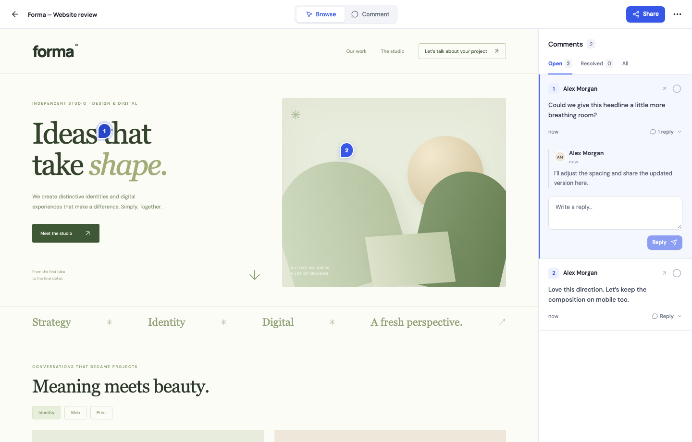
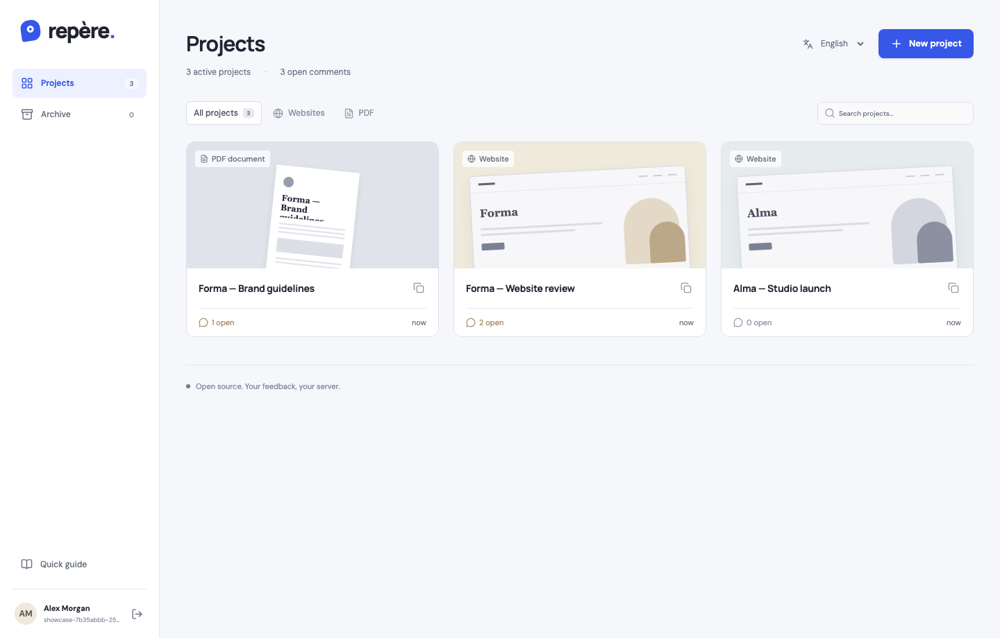
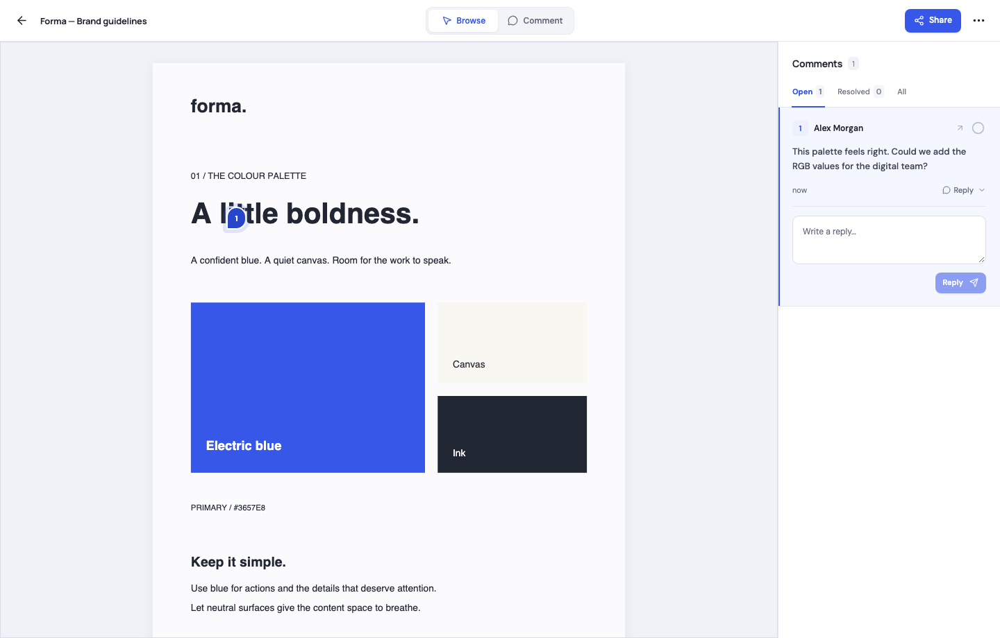
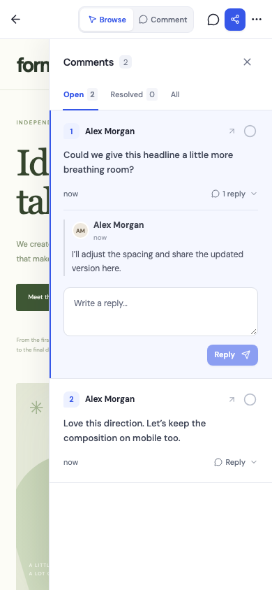
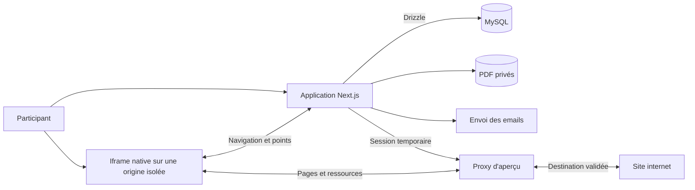

<div align="right">

[English](README.md) · **Français**

</div>

<div align="center">


# Repère

### Les retours, au bon endroit.

Relisez vos sites et PDF ensemble. Un lien, un point, une conversation dans son contexte.

**Open source · Auto-hébergeable · Licence MIT · Français et anglais**

[Démarrer](#démarrer-en-local) · [Fonctionnalités](#fonctionnalités) · [Déploiement](docs/DEPLOYMENT.md) · [Documentation](#documentation) · [Star sur GitHub](https://github.com/Synapsr/Repere)

</div>

---

## Un endroit commun pour les détails

Repère aide les agences, clients et équipes à relire leur travail sans accumuler les captures d'écran et les messages dispersés. Créez un projet, partagez son lien et laissez chacun commenter exactement l'endroit qui mérite votre attention.

Les participants s'identifient avec un **code de six chiffres reçu par email**. Chaque commentaire conserve son auteur, sa page et sa position. Les sites restent interactifs dans le navigateur du visiteur ; les points sur les PDF sont attachés à une page précise.

Repère est une alternative open source indépendante pour le cas d'usage de retour visuel popularisé par Markup.io. Le projet n'y est pas affilié et n'en reprend aucun code ni asset propriétaire.



<details>
<summary><strong>Voir le tableau de bord, le lecteur PDF et la vue mobile</strong></summary>





</details>

## Fonctionnalités

|                               | Ce que vous pouvez faire                                                                                                                  |
| ----------------------------- | ----------------------------------------------------------------------------------------------------------------------------------------- |
| **Espaces de travail**        | Créer des espaces, passer de l’un à l’autre et déplacer des projets sans perdre leurs retours ni leurs liens.                             |
| **Votre équipe**              | Inviter par email, suivre les invitations en attente et gérer les membres d’un espace.                                                    |
| **Sites et PDF**              | Ajouter une URL ou importer un PDF privé jusqu'à 20 Mio. Rechercher et filtrer vos projets.                                               |
| **Un lien partagé**           | Inviter des participants qui vérifient leur email avec un code à usage unique. Aucun mot de passe à créer.                                |
| **Des retours précis**        | Attacher un point à un élément et une page du site, ou à une position sur une page PDF.                                                   |
| **Une navigation naturelle**  | Parcourir le site, sélectionner du texte, suivre ses liens et utiliser ses contrôles. Passer en mode commentaire pour poser un point.     |
| **Des conversations claires** | Répondre, résoudre, rouvrir et filtrer les retours. Chaque commentaire conserve son auteur.                                               |
| **La gestion des projets**    | Renommer, archiver, restaurer et renouveler le lien de partage. Les conversations archivées restent lisibles par les membres de l’espace. |
| **Français et anglais**       | Choisir votre langue ou utiliser celle de votre navigateur. Le lien du projet est identique dans les deux langues.                        |
| **Votre infrastructure**      | Exécuter Next.js, MySQL et le service d'aperçu avec Docker. Conserver les PDF dans un volume privé.                                       |

Le code ne comporte ni formules tarifaires ni frais par participant. L'hébergement et l'envoi des emails restent à votre charge. Les conversations se rafraîchissent toutes les huit secondes lorsque l'onglet est visible. Les miniatures des projets sont des illustrations, pas des captures actualisées.

## Démarrer en local

**Vous déployez sur EasyPanel avec une base MySQL existante ?** Suivez le [guide des deux services](docs/EASYPANEL.md#français) : application sur le port 3000, aperçu sur le port 3001 et votre base actuelle. L’image unique ci-dessous reste une autre possibilité.

L'image `synapsr/repere` réunit l'application, le service d'aperçu natif et **MySQL 8.4 dans un seul conteneur**. Elle génère et conserve ses secrets, initialise la base et applique les migrations automatiquement. Seul Docker est nécessaire sur votre machine.

**[La version 0.3.0 est disponible sur Docker Hub](https://hub.docker.com/r/synapsr/repere)** pour Linux AMD64 et ARM64. Les deux variantes ont démarré avec MySQL intégré et leurs manifests publics ont été vérifiés sans authentification après publication ; voir le [compte rendu de vérification](docs/VERIFICATION.md#workspace-invitations-030--16-september-2026).

Créez `.env.docker` avec les paramètres de votre fournisseur SMTP : la connexion nécessite de recevoir un code par email.

```dotenv
APP_URL=http://localhost:8080
PREVIEW_BASE_URL=http://localhost:8080
SMTP_HOST=smtp.example.com
SMTP_PORT=587
SMTP_USER=replace-me
SMTP_PASSWORD=replace-me
SMTP_FROM=Repere <hello@example.com>
SMTP_SECURE=false
```

```sh
docker run -d --name repere --restart unless-stopped \
  -p 8080:8080 --stop-timeout 40 \
  -v repere-data:/data \
  --env-file .env.docker \
  synapsr/repere:0.3.0
```

Ouvrez [localhost:8080](http://localhost:8080). Conservez le volume **`/data`** : il contient la base, les PDF et les secrets générés. Utilisez une version publiée précise ou un digest pour des déploiements reproductibles. Une [base MySQL externe](docs/DOCKER.md#external-mysql) reste possible.

Dans **EasyPanel**, choisissez [deux services avec votre MySQL existant](docs/EASYPANEL.md#français), ou déployez [cette image unique sur le port 8080](docs/DOCKER.md#français).

### Votre première relecture

1. Ouvrez l'application et indiquez votre prénom et votre adresse email.
2. Saisissez le code de connexion reçu dans votre boîte email.
3. Créez un projet à partir d'une URL ou d'un PDF. Essayez le site interactif inclus ou importez le [PDF d'exemple de deux pages](docs/examples/brand-guidelines.pdf).
4. Explorez le contenu, passez en mode commentaire, cliquez sur un détail et publiez votre retour.
5. Copiez le lien de partage. Un autre participant peut l'ouvrir dans son navigateur et s'identifier avec son email.
6. Répondez et résolvez les retours dans le panneau de conversation.

### Développer depuis les sources

Pour des services séparés, le rechargement à chaud ou une boîte Mailpit locale, utilisez l'installation de développement. Elle demande Docker Compose v2 et Node.js 22.13+ ; Node.js 24 est recommandé.

```sh
git clone https://github.com/Synapsr/Repere.git
cd Repere
node scripts/setup.mjs
```

Le script construit les services, crée un `.env` ignoré par Git, choisit des ports disponibles et applique les migrations. Par défaut, l'application se trouve sur [localhost:3000](http://localhost:3000), Mailpit sur [localhost:8026](http://localhost:8026) et le service d'aperçu utilise le port 3001. Les emails sont capturés localement. La configuration et les volumes existants sont conservés.

Pour arrêter cette installation sans supprimer ses données :

```sh
docker compose -f compose.yaml -f compose.dev.yaml down
```

## Comment fonctionne la relecture web

Repère sert le site à travers un reverse proxy sur une origine temporaire isolée. Une iframe native affiche le site et un petit script injecté suit la navigation et les points. Le JavaScript du site s'exécute dans le navigateur du visiteur ; les fichiers JavaScript conservent leurs octets d'origine.

L'application gère les identités et les conversations. Le service d'aperçu transporte le site. Un canal de messages vérifié relie les deux ; un commentaire n'est enregistré qu'après une action explicite dans l'application.



Les ancres web conservent l'URL originale, un sélecteur d'élément, un extrait textuel et des coordonnées relatives, avec des coordonnées de repli dans le document. PDF.js affiche les pages localement, avec les ressources de décodage nécessaires aux documents scannés.

### Les limites de compatibilité

Un changement d'origine peut affecter le comportement d'un site. Repère adapte les URL HTML/CSS de la même origine, les attributs du DOM, `fetch`, XHR, l'historique et les WebSockets, mais **ne garantit pas la compatibilité avec tous les sites**.

- Un projet correspond à une origine. Les redirections initiales établissent son URL canonique ; les liens vers une autre origine s'ouvrent séparément.
- Le CORS tiers, OAuth, les protections anti-bot, les clés liées à un domaine, les service workers et les scripts dépendant de leur nom d'hôte peuvent demander des adaptations.
- Les cookies et le stockage du site appartiennent à une session d'aperçu isolée. Vos connexions au site original ne sont pas importées. Les règles de cookies du navigateur influencent également la connexion dans l'aperçu.
- Les points ne traversent pas les iframes d'une autre origine ni les shadow DOM fermés. Si l'élément change, le point peut utiliser ses coordonnées de repli.
- La vue étroite change la largeur disponible ; elle ne simule pas toutes les caractéristiques d'un téléphone.
- Les PDF utilisent un canvas sans couche de sélection ou de recherche textuelle. Les documents chiffrés ou invalides affichent une erreur.

Le service d'aperçu conserve ses sessions en mémoire et fonctionne actuellement avec **une seule instance**. Son redémarrage demande de rouvrir les aperçus ; projets, PDF et conversations restent persistants. Consultez [l'architecture des aperçus](docs/PREVIEW.md) pour le détail.

## Déployer sur votre serveur

Sur EasyPanel avec une base existante, commencez par le [guide application et aperçu](docs/EASYPANEL.md#français). L’[image unique](docs/DOCKER.md#français) et l’[installation Compose](docs/DEPLOYMENT.md) restent d’autres modes de déploiement.

Un déploiement public demande :

- Un domaine applicatif en HTTPS.
- Un domaine HTTPS wildcard pour les aperçus, par exemple `*.repere.dev`, avec priorité à la route exacte `app.repere.dev` de l’application. Le domaine nu `repere.dev` peut accueillir un site distinct.
- Un service SMTP pour les codes de connexion.
- Des sauvegardes de MySQL, des PDF et de la configuration.

Ces modes de déploiement utilisent une seule instance du service d'aperçu. Gardez une seule réplique et arrêtez l'ancien conteneur avant son remplacement lorsqu'il utilise le volume MySQL intégré. Les tests locaux ne valident pas vos futurs DNS, certificats ou fournisseur SMTP.

## Stack

| Couche          | Technologie                                                                       |
| --------------- | --------------------------------------------------------------------------------- |
| Application     | Next.js 16 App Router, React 19, TypeScript strict                                |
| Base de données | MySQL 8.4, Drizzle ORM, migrations SQL versionnées                                |
| Langues         | next-intl, anglais et français                                                    |
| Identité        | OTP email, Nodemailer, sessions côté serveur                                      |
| Aperçu web      | Node.js, parse5, pont d'annotation DOM natif                                      |
| Documents       | PDF.js, stockage privé sur disque                                                 |
| Interface       | CSS, icônes Lucide, polices embarquées                                            |
| Déploiement     | Image Docker unique, Compose optionnel, stockage persistant et contrôles de santé |
| Vérification    | Vitest, Playwright, MySQL et Mailpit réels                                        |

Les versions exactes sont fixées dans [package.json](package.json) et [package-lock.json](package-lock.json).

## Documentation

Les guides Docker et EasyPanel contiennent une section française. Les autres guides techniques sont en anglais pour faciliter les contributions.

| Guide                                                       | Contenu                                                      |
| ----------------------------------------------------------- | ------------------------------------------------------------ |
| [EasyPanel avec MySQL existant](docs/EASYPANEL.md#français) | Application et aperçu séparés, domaines et paramètres        |
| [Image Docker](docs/DOCKER.md#français)                     | Un conteneur, MySQL intégré ou externe, données persistantes |
| [Déploiement](docs/DEPLOYMENT.md)                           | Domaines de production, SMTP, configuration et maintenance   |
| [Développement et tests](docs/TESTING.md)                   | Développement local, tests d'intégration et navigateurs      |
| [Architecture des aperçus](docs/PREVIEW.md)                 | Transport, cookies, messages et compatibilité                |
| [Backend](docs/BACKEND.md)                                  | Identité, droits, limites, persistance et imports            |
| [Contrats API](docs/CONTRACT.md)                            | Routes, types partagés et protocole d'aperçu                 |
| [Compte rendu de vérification](docs/VERIFICATION.md)        | Contrôles réellement effectués et portée des résultats       |
| [Sécurité](SECURITY.md)                                     | Signalement d'une vulnérabilité et frontières du déploiement |
| [Contribution](CONTRIBUTING.md)                             | Organisation, traductions, migrations et pull requests       |

## Roadmap

La priorité actuelle est un parcours complet et compréhensible de points et commentaires. Les évolutions prévues comprennent :

- **Retours audio :** enregistrement, lecture et transcription Whisper optionnelle. Le schéma réserve les métadonnées, la durée, l'état de transcription et le fournisseur.
- **Suggestions de texte :** sélectionner un passage, proposer un remplacement et prévisualiser la modification dans la page. Les textes original et proposé disposent de champs réservés.
- Notifications de commentaires, exports, suppression des comptes et règles de conservation.
- Rôles et permissions d’équipe plus détaillés.
- Sélection textuelle dans les PDF, versions de documents et pièces jointes supplémentaires.
- Nouveaux cas de compatibilité, stockage S3 et sessions d'aperçu distribuées.

Ce sont des évolutions futures, pas des fonctions exposées par l'API actuelle. Le [changelog](CHANGELOG.md) récapitule les évolutions publiées.

## Contribuer

Les rapports de bugs, cas de compatibilité reproductibles, traductions, corrections documentaires et pull requests ciblées sont bienvenus. Commencez par [CONTRIBUTING.md](CONTRIBUTING.md). Signalez les vulnérabilités par la voie privée décrite dans [SECURITY.md](SECURITY.md).

## Licence

Repère est distribué sous [licence MIT](LICENSE), qui autorise notamment l'usage commercial et la modification. Conservez les mentions requises lors d'une redistribution. Les polices, icônes et ressources PDF gardent leurs propres licences : voir [THIRD_PARTY_NOTICES.md](THIRD_PARTY_NOTICES.md).
