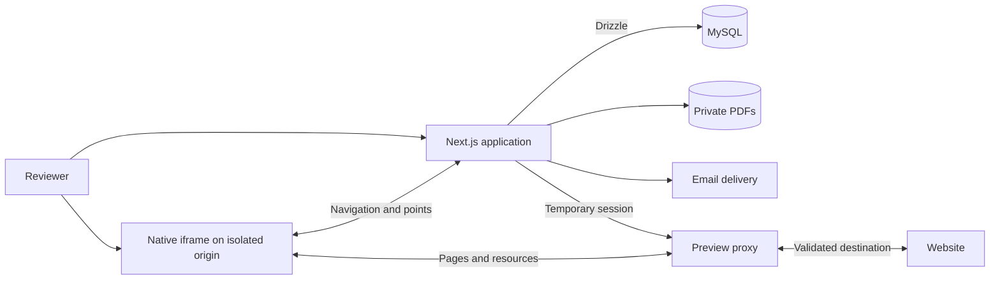

<div align="right">

**English** · [Français](README.fr.md)

</div>

<div align="center">


# Repère

### Feedback, right where it belongs.

Review websites and PDFs together. Share one link, place a point, keep the conversation in context.

**Open source · Self-hosted · MIT licensed · English & French**

[Quick start](#quick-start) · [Features](#features) · [Deployment](docs/DEPLOYMENT.md) · [Documentation](#documentation) · [Star on GitHub](https://github.com/Synapsr/Repere)

</div>

---

## A shared place for the details

Repère helps agencies, clients and teams review work without collecting screenshots and disconnected messages. Create a project, share its link, and invite people to comment exactly where something needs attention.

Reviewers sign in with a **six-digit email code**. Every comment keeps its author, page and position. Websites remain interactive in the reviewer's own browser, and PDFs have points attached to individual pages.

Repère is an independent, open-source alternative for the visual feedback use case popularized by Markup.io. It is not affiliated with Markup.io and includes no proprietary code or assets from it.


<details>
<summary><strong>See the dashboard, PDF review and mobile layout</strong></summary>


</details>

## Features

|                         | What you can do                                                                                                     |
| ----------------------- | ------------------------------------------------------------------------------------------------------------------- |
| **Websites and PDFs**   | Add a URL or upload a private PDF up to 20 MiB. Search and filter your projects.                                    |
| **One shared link**     | Invite reviewers who verify their email with a one-time code. No password to create.                                |
| **Precise feedback**    | Attach a point to a website element and page, or to a position on a PDF page.                                       |
| **Natural navigation**  | Browse, select text, follow links and use the site's controls. Switch to commenting when you want to place a point. |
| **Clear conversations** | Reply, resolve, reopen and filter feedback. Authors stay attached to their comments.                                |
| **Project controls**    | Rename, archive, restore and renew a sharing link. Archived conversations remain readable by the owner.             |
| **English and French**  | Choose a language, or start with your browser's preference. Share the same project URL in either language.          |
| **Your infrastructure** | Run Next.js, MySQL and the preview service with Docker. Store PDFs in a private volume.                             |

There are no plan tiers or per-reviewer charges in the code. Hosting and email delivery are your responsibility. Conversations refresh every eight seconds while the tab is visible. Project thumbnails are illustrations, not live screenshots.

## Quick start

**Requirements:** Docker with Compose v2 and Node.js 22.13+. Node.js 24 is recommended and used in the Docker images.

Clone the repository, then run setup:

```sh
git clone https://github.com/Synapsr/Repere.git
cd Repere
node scripts/setup.mjs
```

Setup creates a private `.env` with independent random secrets, selects available local ports, builds the images, starts MySQL and runs the versioned migrations before the application. Existing environment values and data volumes are preserved.

| Service           | Default local address                   |
| ----------------- | --------------------------------------- |
| Application       | [localhost:3000](http://localhost:3000) |
| Development inbox | [localhost:8026](http://localhost:8026) |
| Preview service   | `<session>.localhost:3001`              |
| MySQL             | `127.0.0.1:3308`                        |

Check `APP_URL` and `MAILPIT_URL` in `.env` if a default port was already occupied. Local preview subdomains resolve to your machine; no external domain is needed.

### Your first review

1. Open the application and enter your name and an email address.
2. Read the sign-in code in **Mailpit**, the local development inbox. This setup does not deliver mail to the internet.
3. Create a project from a website URL or PDF. Try the included interactive website or upload the [two-page sample PDF](docs/examples/brand-guidelines.pdf).
4. Explore the content, switch to commenting, click a detail and publish your feedback.
5. Copy the sharing link. A reviewer can open it in another browser and sign in with their own email.
6. Reply and resolve feedback in the conversation panel.

Stop the local stack without removing its data:

```sh
docker compose -f compose.yaml -f compose.dev.yaml down
```

The repository currently builds its Docker images from source. No published container image is provided.

## How website review works

Repère serves the website through a reverse proxy on a temporary, isolated origin. A native iframe displays the site, and a small injected script tracks navigation and annotation points. The site's JavaScript runs in the reviewer's browser; JavaScript files retain their original bytes.

The application handles identity and conversations. The preview service handles website traffic. A verified message channel connects the two, while comments are saved only after an explicit action in the application.



Web anchors store the original URL, an element selector, a text excerpt and relative coordinates, with document coordinates as a fallback. PDF.js renders PDF pages locally, including the bundled decoding resources needed by scanned documents.

### Compatibility has boundaries

A different origin can affect website behavior. Repère adapts same-origin HTML/CSS URLs, DOM URL attributes, `fetch`, XHR, history and WebSockets, but **does not guarantee compatibility with every website**.

- A project reviews one origin. Initial redirects establish its canonical URL; links to another origin open separately.
- Third-party CORS, OAuth, anti-bot systems, domain-bound keys, service workers and scripts that depend on their original hostname may need additional work.
- Website cookies and storage belong to an isolated preview session. Existing logins on the original site are not imported. Browser cookie policies also affect sign-in inside a preview.
- Points cannot reach inside cross-origin frames or closed shadow roots. If the target element changes, a point may use its coordinate fallback.
- The narrow preview changes the available width; it does not emulate all phone hardware features.
- PDF pages use a canvas without a text selection/search layer. Encrypted or invalid documents show an error.

The preview service keeps sessions in memory and currently runs as **one instance**. Restarting it requires reopening previews; projects, PDFs and conversations remain persistent. Read the [preview architecture](docs/PREVIEW.md) for the exact behavior.

## Deploy on your server

Use **`compose.yaml`** for production. The development overlay adds Mailpit and access to the private demo host.

A public deployment needs:

- An HTTPS application domain.
- A separate registrable domain for previews, with wildcard DNS and TLS.
- An SMTP service for sign-in codes.
- Backups of MySQL, PDF uploads and configuration.

The [deployment guide](docs/DEPLOYMENT.md) covers environment settings, the supplied [Nginx example](docs/nginx.conf), startup, backups and upgrades. Local tests do not validate your future DNS, certificates or SMTP provider.

## Stack

| Layer           | Technology                                                     |
| --------------- | -------------------------------------------------------------- |
| Application     | Next.js 16 App Router, React 19, strict TypeScript             |
| Database        | MySQL 8.4, Drizzle ORM, versioned SQL migrations               |
| Languages       | next-intl, English and French                                  |
| Identity        | Email OTP, Nodemailer, server-side sessions                    |
| Website preview | Node.js, parse5, native DOM annotation bridge                  |
| Documents       | PDF.js, private filesystem storage                             |
| UI              | CSS, Lucide icons, locally bundled fonts                       |
| Deployment      | Docker Compose, non-root application containers, health checks |
| Verification    | Vitest, Playwright, real MySQL and Mailpit                     |

Exact dependency versions are pinned in [package.json](package.json) and [package-lock.json](package-lock.json).

## Documentation

| Guide                                       | Contents                                                    |
| ------------------------------------------- | ----------------------------------------------------------- |
| [Deployment](docs/DEPLOYMENT.md)            | Production domains, SMTP, configuration and maintenance     |
| [Development and testing](docs/TESTING.md)  | Host development, real integration tests and browser checks |
| [Preview architecture](docs/PREVIEW.md)     | Transport, cookies, annotation messages and compatibility   |
| [Backend](docs/BACKEND.md)                  | Identity, permissions, rate limits, persistence and uploads |
| [API contracts](docs/CONTRACT.md)           | Routes, shared types and preview protocol                   |
| [Verification record](docs/VERIFICATION.md) | What was actually checked, and the scope of that evidence   |
| [Security](SECURITY.md)                     | Reporting a vulnerability and deployment boundaries         |
| [Contributing](CONTRIBUTING.md)             | Workflow, translations, migrations and pull requests        |

## Roadmap

The current focus is a complete, understandable point-and-comment workflow. Planned work includes:

- **Audio feedback:** recording, playback and optional Whisper transcription. The schema reserves attachment metadata, duration, transcription status and provider.
- **Text suggestions:** select a passage, propose a replacement and preview the change in the page. Original and suggested text have reserved fields.
- Comment notifications, exports, account deletion and retention controls.
- Organizations, team roles and invitations.
- PDF text selection, document versions and additional attachments.
- More compatibility fixtures, S3 storage and distributed preview sessions.

These are future capabilities, not features exposed by the current API. See the [changelog](CHANGELOG.md) for the work prepared for this first release.

## Contributing

Bug reports, reproducible website compatibility cases, translations, documentation and focused pull requests are welcome. Start with [CONTRIBUTING.md](CONTRIBUTING.md). Report vulnerabilities through the private route described in [SECURITY.md](SECURITY.md).

## License

Repère is licensed under [MIT](LICENSE), including commercial use and modification. Keep the required license notices when redistributing it. Fonts, icons and PDF resources retain their own licenses; see [THIRD_PARTY_NOTICES.md](THIRD_PARTY_NOTICES.md).
